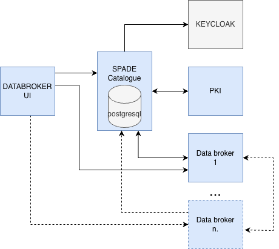

# SPADE Cloud Platform


Docker Compose deployment configuration for the SPADE (Secure Platform for Advanced Data Exchange) Cloud platform. This platform provides a complete infrastructure for secure data collaboration, identity management, and PKI services.

## Overview

SPADE Cloud is a modular platform consisting of core SPADE services and industry-standard external components for authentication and certificate management. All services are containerized and orchestrated using Docker Compose with Traefik as the reverse proxy.




## Services

### SPADE Core Services

#### **Data Broker UI**
Web interface for data discovery and access management. Provides users with a friendly interface to browse, search, and request access to data resources within the SPADE ecosystem.

- **Technology**: Angular-based SPA
- **Port**: 4200 (internal)
- **Access**: Via Traefik at configured domain
- **Configuration**: Uses environment variables from `.env`

#### **Entrypoint**
Main API gateway for the SPADE platform. Handles authentication, authorization, and routing for all SPADE services.

- **Technology**: Node.js/Express
- **Port**: 3000 (internal)
- **Access**: Via Traefik at configured domain
- **Dependencies**: Requires Keycloak for authentication

#### **Catalogue**
Core data catalogue service managing metadata, schemas, and access policies for data resources. Implements the SPADE data model and provides APIs for data discovery and management.

- **Technology**: Node.js using PostgreSQL
- **Port**: 4000 (internal)
- **Database**: PostgreSQL 17 (auto-initialized)
- **Access**: Via Traefik at configured domain
- **Environment Variables**:
  - `DB_HOST`: Database hostname (set to `catalogue_db`)
  - `DB_PORT`: Database port (5432)
  - `DB_NAME`: Database name
  - `DB_USER`: Database username
  - `DB_PASSWORD`: Database password
  - Additional variables in `.env` file
- **Persistent Data**: Stored in `catalogue_db_data` volume
- **API Documentation**: OpenAPI specification available in `openapi/swagger-catalogue.yaml`
- **Database Setup**: Use `initdb.sh` script for additional database initialization if needed

#### **PKI Service**
Standalone certificate authority service providing full PKI lifecycle management for SPADE participants. Issues, stores, and revokes X.509 certificates using a custom Root CA and Subordinate CA.

- **Technology**: Python/FastAPI
- **Port**: 80 (internal)
- **Access**: Via Traefik at configured domain
- **Configuration**: All settings via `.env` (mounted into container)
- **Certificate Storage**: SQLite database in `certs/` directory
- **Prerequisites**: Run `generateCas.sh` before first start
- **API Documentation**: OpenAPI specification available in `openapi/swagger-pki.yaml`

### External Services

#### **Keycloak** (Identity & Access Management)
Industry-standard open-source IAM solution providing authentication and authorization services.

- **Version**: Bitnami Keycloak 22
- **Database**: PostgreSQL 15.5 (auto-initialized)
- **Admin Access**: Use credentials from `KEYCLOAK_ADMIN_USER` and `KEYCLOAK_ADMIN_PASSWORD`
- **Documentation**: [Keycloak Official Documentation](https://www.keycloak.org/documentation)
- **Configuration**: Set database and admin credentials in `.env`
- **Custom Themes**: Optional - uncomment volume mount in `docker-compose.yml`

## Prerequisites

- **Docker Engine** 20.10 or higher
- **Docker Compose** v2.0 or higher
- **OpenSSL** (for `generateCas.sh`)
- **Traefik** reverse proxy running with:
  - SSL certificate resolver configured (named `myresolver`)
  - External network connectivity
  - Access to configured domains
- **DNS Configuration**: Domain names must resolve to your server
- **Operating System**: Linux (tested on Ubuntu 20.04+)

## Deployment

### 1. Clone Repository

```bash
git clone <repository-url>
cd spade-cloud
```

### 2. Configure Environment

```bash
cp .env.example .env
```

Edit `.env` and configure:
- Domain names for all services
- Docker registry and image tags
- Database credentials (use strong passwords)
- Keycloak admin credentials
- PKI service settings (see step 3)

### 3. Generate CA Certificates

Run the CA generation script to create the Root CA and Subordinate CA:

```bash
./generateCas.sh
```

This creates `certs/rootCA.p12`, `certs/subCA.p12`, and `certs/passwords.txt`.

Copy the **SUB CA** password from `certs/passwords.txt` into `CA_SUBCA_KEY` in your `.env` file.

Also update `CRL_URL` in `.env` to match your actual `PKI_DOMAIN`:
```
CRL_URL=https://pki.yourdomain.com/pki/certificates/revocation-list
```

After copying the password, delete `certs/passwords.txt`:
```bash
rm certs/passwords.txt
```

### 4. Initialize and Configure Keycloak

Configure Keycloak according to the [Keycloak Getting Started Guide](https://www.keycloak.org/getting-started). Set up realm, clients, and user federation as required for SPADE services.

### 5. Start Services

```bash
docker compose up -d
```

### 6. Initialize Catalogue Database

Run the database initialization script for the catalogue service:

```bash
./initdb.sh
```

## Service Architecture

```
Internet
   ↓
Traefik (SSL/TLS Termination & Routing)
   ↓
   ├─→ Data Broker UI (Frontend)
   ├─→ Entrypoint (API Gateway)
   ├─→ Catalogue (Core Service) ─→ PostgreSQL
   ├─→ Keycloak (IAM) ─→ PostgreSQL
   └─→ PKI Service (CA) ─→ certs/ (SQLite + PKCS#12)
```

All services communicate via the internal `spade_network` Docker bridge network.

## Maintenance

### View Logs
```bash
# All services
docker compose logs -f

# Specific service
docker compose logs -f catalogue

# Last 100 lines
docker compose logs --tail=100 catalogue
```

### Update Services
```bash
# Pull latest images
docker compose pull

# Restart with new images
docker compose up -d

# Or update specific service
docker compose up -d catalogue
```

## License

This project (SPADE Cloud Platform) is licensed under the [Apache License 2.0](https://www.apache.org/licenses/LICENSE-2.0).

### Third-Party Components

- **Keycloak**: Licensed under [Apache License 2.0](https://github.com/keycloak/keycloak/blob/main/LICENSE.txt)
- **PostgreSQL**: Licensed under [PostgreSQL License](https://www.postgresql.org/about/licence/) (permissive open-source license)
- **Traefik**: Licensed under [MIT License](https://github.com/traefik/traefik/blob/master/LICENSE.md)

## Support

For issues specific to:
- **SPADE services**: Contact bAvenir support at [support@bavenir.com](mailto:support@bavenir.com)
- **Keycloak**: See [Keycloak Community](https://www.keycloak.org/community)
- **Docker/Infrastructure**: Check Docker and Traefik documentation
